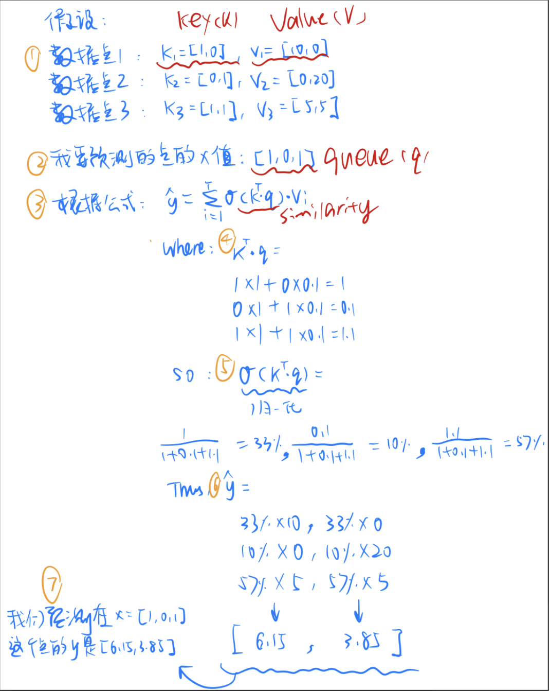
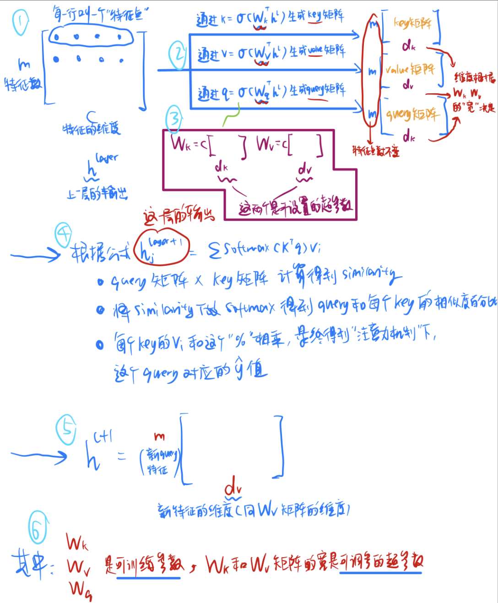
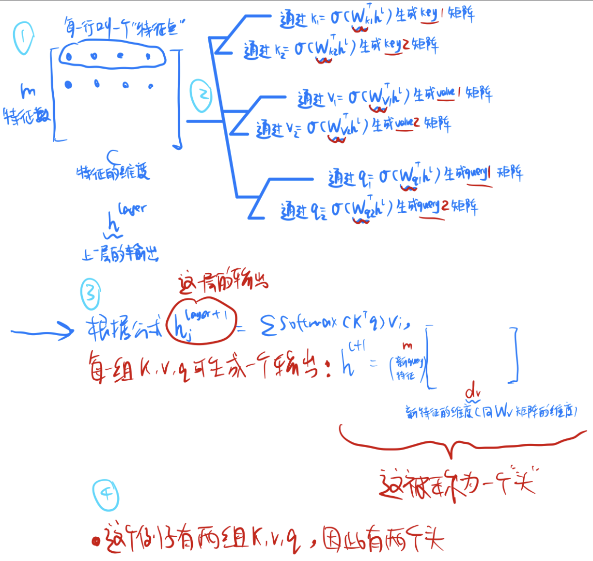

## 1.1 基础架构参数

### Hidden token

每个 token = 一个向量
向量长度 = hidden dimension


### Transformer Block 数量

模型“重复做多少次 Attention + FFN 的计算”。
也可以理解成Token input经过几次“思考循环”。
一次（个）transformer block，就是神经网络的一层。

每一个block可以是：
RMSNorm → Attention → Residual
RMSNorm → FFN/MoE → Residual

如果transformer block = 2，那就是这样：

Input token embedding
        ↓
   Block 1
        ↓
   Block 2
        ↓
   LM head

此神经网络有input层，output层，和2个中间层

每一个block就是：
    input -> attention(提取局部/全局关系) -> FFN(非线性变换) -> hidden_state_1

    其中FFN只是一层，但是有多个维度（每个维度可以是一个专家）

hidden_state_1 -> attention + FFN(非线性变换,更深语义加工) -> hidden_state_2

hidden_state_2 → LM head → logits

少层（2–4层）
    结构浅
    只学局部 pattern
    推理能力弱

中等层（8–16层）（minimind：8层）
    有一定层级抽象能力
    可以形成语义组合
    能做简单推理

深层（24–80+层）（GPT / LLaMA）
    强抽象能力
    多步推理能力增强
    更强 world model
代价：
    训练成本高
    latency 增加
    gradient 更难优化（虽然 Pre-Norm缓解）

Transformer 的能力不是线性增长：
* depth ↑ → reasoning ↑（但边际递减）

### LM head
LM stands for Language Model
把 Transformer 的 hidden vector 映射回词表空间（vocab space）

MVP例子

    假设：
    hidden_size = 4
    vocab_size = 5

    某个 token hidden：[0.2, -1.0, 0.5, 0.8]

    lm_head 权重：W: (4 → 5)

    输出：logits = [score_word1, word2, word3, word4, word5]

### MoE = Mixture of Experts（混合专家模型）
MoE本质上就是多个 FFN（每个FFN是一个专家）+ 一个 router（路由器）。

- 例子：

在某一层（或某一个transformer block中），有：

input (也就是x) -> RMSNorm -> Attention得到这个x的"softmax(QK^T)V"，因为要用它进行继续同一层神经网络layer的运算，所以它不是output，是residual1。

* query / key / value 是 Attention内部中间变量

        ⬇️

x1 = x + residual1

        ⬇️

x1 -> RMSNorm -> MoE（混合专家模型，多维，每一维是一个expert） -> 选择好E2，E3 ->  SwiGLU激活 "gate_proj(x) + up_proj(x) -> down_proj" -> 得到激活好的x  = w2* E2(x) + w3* E3(x), where 权重来自scores中E2 E3的相对比例，因为要用它进行继续同一层神经网络layer的运算，所以它不是output，是residual 2。

        ⬇️

x2 = x1 + residual 2


- 假设有4个专家，每个token（也就是每个queue需要2个专家来判别），这也叫topk, k=2, num_experts = 4。

- 这里的代码是scores = softmax(gate(h)), 输出几个logits。比如 [E1: 0.1, E2: 0.5, E3: 0.2, E4: 0.2]，那就选E2 E3为专家。

- gate_proj(x) + up_proj(x)是并行的，不是串行。

- gate proj, up proj, down proj都是可学习参数，不是超参数。

        ⬇️

某一层的output = x2，output将作为下一层的input

-------------------------------------------------------

假设x = [2, -1]，
gate_proj(x) = [1, 3]
up_proj(x)   = [2, -2]

* 升维
    gate projection: SiLU([1, 3]) ≈ [0.73, 2.86]
    - 属于控制开关，决定哪些信息该“放大 / 抑制”

    up projection: [0.73, 2.86] ⊙ [2, -2] = [1.46, -5.72]
    - 提供“内容信息”，提供：真正要被变换的特征内容
    - SiLU(gate_proj(x)) * up_proj(x)表示逐元素相乘。
        即 0.73 * 2, 2.86 * -2

* 降维
    down_proj([1.46, -5.72]): [0.8, -1.3] 最终输出
    - 把 intermediate 表达映射回 hidden_size（给 residual 用）

可以理解成：
gate = “要不要用”
up = “用什么内容”
down = “整理回模型空间”

这也叫“门控+内容分离“激活，或“SwiGLU”激活。

    FFN = Linear → RELU → Linear
    SwiGLU = gate × up → non-linear interaction

    效果：
        表达能力 ↑↑
        更稳定（比 ReLU/GELU）
        LLaMA / GPT 类主流结构

* 注意，SwiGLU激活中的gate projection使用了SiLU激活。

### SiLU激活 vs ReLU激活


### dropout
在训练时“随机把一部分神经元输出置 0”的概率，提升robustness，防止过拟合。

kwargs = keyword arguments。kwargs是关键字参数的设置关键词

### tokenizer参数
BOS = Beginning Of Sequence, 表示“序列开始”的特殊 token
EOS = End Of Sequence, 表示“序列结束”的特殊 token

举例子：
input = <BOS> I have apples <EOS>

```
self.bos_token_id = kwargs.get("bos_token_id", 1)
self.eos_token_id = kwargs.get("eos_token_id", 2)
```

BOS的id是1， EOS的id是2，那：
<BOS> I have apples <EOS> 就是 [1, 45, 67, 89, 2]

```
self.vocab_size = kwargs.get("vocab_size", 6400)
```
假设：vocab_size = 5，那大概就是这样：
    token	id
    I	    0
    have	1
    apple	2
    <BOS>	3
    <EOS>	4

这个self.vocab_size会被当作参数传入
- 词嵌入层(Token Embedding): self.embed_tokens
- 语言模型头: self.lm_head = nn.Linear(hidden_size, vocab_size)

### attention

#### 注意力机制



#### 多头注意力


#### flash attention
- 一种“更高效计算 Attention 的方法”
- 不显式算完整 attention matrix（QKᵀ），而是“分块+融合计算”，减少显存占用和加速计算。

例子：普通注意力机制

- attention得到的是"softmax(QK^T)V"。
    - Q的size是 queue长度 x Wq的向量维度
    - K的size是 queue长度 x Wk的向量维度
    - V的size是 queue长度 x Wv的向量长度

- 那 QK^T得到的就是 “queue长度 x Wq的向量维度” x “Wk的向量维度 x queue长度”
- 假设输入的queue长度是4
- 那 QK^T得到的就是 4x4 的矩阵

一个4x4的矩阵：
    [ a11 a12 a13 a14
      a21 a22 a23 a24
      a31 a32 a33 a34
      a41 a42 a43 a44 ]
- 再用这个4x4的矩阵和“V”相乘，V又是一个“queue长度 x Wv的向量长度”的矩阵

在真实的LLM里，推理接受的输入长度最长是4096，每个token有4096维，所以矩阵的实际大小是惊人的4096x4096，所以很吃内存。

- Flash attention 不用存完整 4096×4096 矩阵
- 而是：
    分块计算 QKᵀ
    → 边算 softmax
    → 边乘 V
    → 直接累加结果

粗略的理解：
- 普通 Attention	先算“完整表格”
- Flash Attention	“边算边用，不存表格”

参数的定义：

```
# 是否启用Flash Attention
self.flash_attn = kwargs.get("flash_attn", True)
```

运用在：
```
# 【面试考点】Flash Attention：利用 PyTorch 2.0 的scaled_dot_product_attention
# 底层调用 Flash Attention / memory-efficient attention，无需显式计算注意力矩阵
# 显著降低显存占用和计算时间。
self.flash = (
    hasattr(torch.nn.functional, 'scaled_dot_product_attention')
    and config.flash_attn
)

# 【面试考点】Flash Attention 条件：启用 flash、非单 token、无 mask
# 使用 PyTorch 内置的 fused 注意力实现
F.scaled_dot_product_attention(...)
```

## 1.2 分组查询Attention参数（GQA - Grouped Query Attention）
- 是多头注意力（MHA）和多查询注意力 (MQA) 的折中方案，旨在保持计算速度的同时维持模型性能。

### 普通Attention
在标准 Multi-Head Attention (MHA) 里：

假设
    B = 2（两句话）。B就是batch，input一共有2句话。
    T = 5（每句话 5 个 token）
    d_model = 4。token的hidden dimension是4
    head = 2.注意力头是2个
    如果注意力头是2个，那每个token的维度会从4被划分成2: d_head = 4 / 2 = 2

两句话（token化）
    T1：I | love | to | eat | apple
    T2：eating | apple | is | very | healthy

Step 1：输入 embedding
X shape = (B, T, d_model)
        = (2, 5, 4)
其实这里的“2”才是多维的那个“维”的最好表达。prompt的句子越长，维度越大，给的回复越准

Step 2：生成 Q K V（还没分 head）
线性变换：
    Q = XWq     Q: (2, 5, 4)
    K = XWk     K: (2, 5, 4)
    V = XWv     V: (2, 5, 4)

Step 3：拆 head
把 4 维拆成：→ 2 个 head（2 维）

reshape 后：
    Q → (2, 2, 5, 2)
    K → (2, 2, 5, 2)
    V → (2, 2, 5, 2)

Step 4：展开成“真正 attention 单元”
    Head 0：
        Q0 shape = (2, 5, 2)
        K0 shape = (2, 5, 2)
        V0 shape = (2, 5, 2)
    Head 1：
        Q1 shape = (2, 5, 2)
        K1 shape = (2, 5, 2)
        V1 shape = (2, 5, 2)

Step 5：attention 计算（每个 head 独立）
    attention_0 = softmax(Q0K0^T) x V0, 其size保持(2,5,2)
    attention_1 = softmax(Q1K1^T) x V1, 其size保持(2,5,2)

    然后拼接：concat(O0, O1) = (2, 5, 4)
        这就是2个attention头，每个头包含对5个token的output，每个otuput维度为4


### 分组查询Attention (GAQ)
还是有H个 head，但是K和V并不再有H维，K和V的维度都小于H，且每个头共享不同的维度

为什么要用GAQ？
- 省内存（KV cache更小，因为K和V的维度都小），大概只占“现在的维度/H”%的内存。
- 计算量降低
- 表达能力略降但几乎无感

分组查询Attention例子：

在分组查询Attention（GAQ）里：

假设
    B = 2（两句话）。B就是batch，input一共有2句话。
    T = 5（每句话 5 个 token）
    d_model = 4。token的hidden dimension是4
    num_kv_heads = 1
    head = 2.注意力头是2个
    如果注意力头是2个，那每个token的维度会从4被划分成2: d_head = 4 / 2 = 2

因为有2个head，所以还是：
    Q0 = (2, 2, 5, 2)
    Q1 = (2, 2, 5, 2)

但是kv_head = 1，所以：
    Q0 = Kshared, Vshared
    Q1 = Kshared, Vshared

    两个Q头共享同一套记忆。

"i love to eat apple"这个例子中的apple，
    - Q0("apple")与 K_shared全部token 做点积的到attention0
“eating apple is very healthy”中的apple
    - Q1("apple")与 K_shared全部token 做点积

attention0 ≠ attention1，两个head仍然会关注不同位置。

为什么效果没掉太多？
    - 因为真正决定："我要看谁"的是Q。而Q的信息是完整没有被压缩的。

### 多查询Attention（MQA）
这种极端的“num_kv_heads = 1”的情况，其实就是"MQA - Multi-Query Attention",也叫“多查询注意力”，即让所有注意力头共享同一组键（Key）和值（V）投影矩阵，仅保留独立的查询（Query）投影。

### Minimind 中的分组查询Attention（GAQ）
num_attention_heads = 8
num_key_value_heads = 4
hidden_size = 32（这个是假设的，上面两个是minimind给的参数）

根据代码：
head_dim = hidden_size // num_attention_heads
         = 32 // 8
         = 4
所以最终32维的hidden dim会被分割成8个注意力头，每个注意力头可以分得4个token的维度

还是输入
T1: I | love | to | eat | apple
T2: eating | apple | is | very | healthy

B = 2
T = 5
d_model = 32

所以 X.shape(B,T,d_model) = (2,5,32)

第一步：生成Q
    Q = X @ Wq, Wq = (32, 32)
    所以Q.shape = (2,5,32) 

    然后分成4个头：
    所以Q.shape = (2,8,5,4), B=2, Q_head=8, Token=5, head_dim=4

    每个Q head大概长这样：
        Head0 : (2,5,4)
        Head1 : (2,5,4)
        Head2 : (2,5,4)
        Head3 : (2,5,4)
        Head4 : (2,5,4)
        Head5 : (2,5,4)
        Head6 : (2,5,4)
        Head7 : (2,5,4)

第二步：生成K
    K = X @ Wk

    K的维度 = K头的数量 x 一个attention头分得的Q的维度
           = 4 x 4
           = 16
    
    一共有2句话，每句话5个token，所以K的size就是(2,5,16)

    分成4个K头,K最终就是(2,4,5,4) B=2 Khead=4 token=5 K_dimen=4

    每个K head大概长这样：
        K Head0 : (2,5,4)
        K Head1 : (2,5,4)
        K Head2 : (2,5,4)
        K Head3 : (2,5,4)

第三步：生成V
    V = X @ Wv

    完全同第二步，V最终就是(2,4,5,4) B=2 Khead=4 token=5 V_dimen=4

    每个K head大概长这样：
        V Head0 : (2,5,4)
        V Head1 : (2,5,4)
        V Head2 : (2,5,4)
        V Head3 : (2,5,4)

第四步：repeat_kv()
    因为：
        8 Q heads
        4 KV heads

    所以：每个KV head要复制2次，变成 K = (2,8,5,4). V = (2,8,5,4)：
        KVHead0
        KVHead0

        KVHead1
        KVHead1

        KVHead2
        KVHead2

        KVHead3
        KVHead3

    为什么要repeat_kv()？- 因为之后需要计算QK^T * V,且最后要拼接
     - 把它复制一下，比像MHA那样计算需要的计算资源和内存资源要小得多

第五步：计算每个注意力head
    Attention = Q*K^T
              = (5,4) * (4,5)，where(5,4)是Q的size，(4,5)是K^T的size
              = (5,5)
    即得到每个token的feedback output，每个output有5个维度
    因为有2句，共8个头，所以最终的output是(2,8,5,5)

    例如 apple 会得到：

        I       0.10 a2 a3 a4 a5
        love    0.15 b1 b2 b3 b4 b5
        to      0.05 c1 c2 c3 c4 c5
        eat     0.30 d1 d2 d3 d4 d5
        apple   0.40 e1 e2 e3 e4 e5

        eating      0.10 a2 a3 a4 a5
        apple       0.15 b1 b2 b3 b4 b5
        is          0.05 c1 c2 c3 c4 c5
        very        0.30 d1 d2 d3 d4 d5
        healthy     0.40 e1 e2 e3 e4 e5
        
        这种东西 x 8。
    
    再乘V，(2,8,5,5) x (2,8,5,4)^T, where(5,5) x (5,4) -> (2，8，5，4)
    这就是最终的attention output(2,8,5,4)

第六步：拼接
    现在 output(2,8,5,4) B=2 head=8 token=5 head_dimen=4
    cancat这8个头:(2,5,32)。这就是最终的output

    Q 总维度仍然是 32，但 K/V 总维度只有 16。
        这正是 GQA 节省 KV Cache 的来源：
            MHA:
            K = 8×4 = 32
            V = 8×4 = 32

            GQA:
            K = 4×4 = 16
            V = 4×4 = 16


假设：
    hidden_size = 8
    num_attention_heads = 4
    num_key_value_heads = 2
    head_dim = 8 / 4 = 2

实际的代码实现中，假如token的hidden size是8，那么可能把这100000个维度分成5个attention head。

在回到例子本身，假设输入的token是4个，那输入的input x的size就是 4x8

因为num_attention_heads = 4，所以把 4x8 的矩阵 reshape成 4个 4x2的矩阵

比如Q：
    [ a11 a12 a13 a14 a15 a16 a17 a18
      a21 a22 a23 a24 a25 a26 a27 a28
      a31 a32 a33 a34 a35 a36 a37 a38
      a41 a42 a43 a44 a45 a46 a47 a48 ]

变成
    [ a11 a12   [ a13 a14   [ a15 a16   [ a17 a18
      a21 a22     a23 a24     a25 a26     a27 a28
      a31 a32     a33 a34     a35 a36     a37 a38
      a41 a42 ]   a43 a44 ]   a45 a46 ]   a47 a48 ]
(attention head1)(attention head2)(attention head3)(attention head4)
(可能关注语法)      （可能关注意义）    （可能关注位置）    （可能关注上下文）

这就是Q。queue长度=4，注意力头数量=4， 注意力头维度=2

从一开始直觉的理解“Q = queue长度 * token维度” 变成：
    - “queue长度 * 注意力头数量 * 注意力头维度”

我们知道了概念，也知道了假设已知的数据：“num_key_value_heads = 2”。

那K也就等于 4 * 2 * 2, where queue长度=4，K矩阵的数量=2， K矩阵的维度=2
那V也就等于 4 * 2 * 2, where queue长度=4，V矩阵的数量=2， V矩阵的维度=2


Q的size就是：attention head的数量 * 注意力头的维度


num_attention_heads
num_key_value_heads
head_dim = self.hidden_size // self.num_attention_heads


首先，attention得到的是"softmax(QK^T)V"。
* Flash Attention = 不显式算完整 attention matrix（QKᵀ），而是“分块+融合计算”，减少显存占用和加速计算。


## 


- 是什么 -举个简单MVP例子（就事论事，不要举不相关的例子） - 不同的设置的不同效果是什么，简单说说